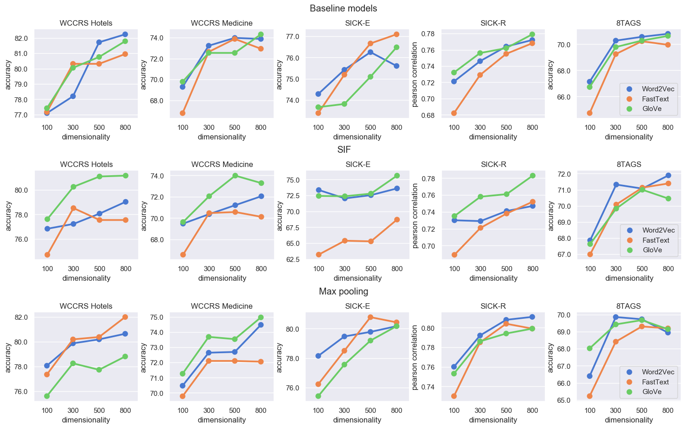

### Evaluation of Sentence Representations in Polish
This repository contains source code from the paper "[Evaluation of Sentence Representations in Polish](https://arxiv.org/pdf/1910.11834.pdf)". 
The paper contains evaluation of eight sentence representation methods (Word2Vec, GloVe, FastText, ELMo, Flair, BERT, LASER, USE) on five polish linguistic tasks.
Dataset for these tasks are distributed with the repository and two of them are released specifically for this evaluation:
the [SICK (Sentences Involving Compositional Knowledge)](https://github.com/text-machine-lab/MUTT/tree/master/data/sick) corpus translated to Polish and 8TAGS classification dataset.
Pre-trained models used in this study are available for download in separate repository: [Polish NLP Resources](https://github.com/sdadas/polish-nlp-resources).

### Updates:

- **01.02.2020** - Added [Polish RoBERTa](https://github.com/sdadas/polish-nlp-resources#roberta) model and multilingual [XLM-RoBERTa (large)](https://github.com/pytorch/fairseq/tree/master/examples/xlmr) model

<table>
  <thead>
    <th><strong>Method</strong></th>
    <th><strong>Language</strong></th>
    <th><strong>WCCRS Hotels</strong></th>
    <th><strong>WCCRS Medicine</strong></th>
    <th><strong>SICK-E</strong></th>
    <th><strong>SICK-R</strong></th>
    <th><strong>8TAGS</strong></th>
  </thead>
  <tr>
    <td colspan="7"><strong>Word embeddings</strong></td>
  </tr>
  <tr><td>Random</td><td>n/a</td><td>65.83</td><td>60.64</td><td>72.77</td><td>0.628</td><td>31.95</td></tr>
    <tr><td>Word2Vec</td><td>Polish</td><td>78.19</td><td><strong>73.23</strong></td><td><strong>75.42</strong></td><td>0.746</td><td><strong>70.27</strong></td></tr>
    <tr><td>GloVe</td><td>Polish</td><td>80.05</td><td>72.54</td><td>73.81</td><td><strong>0.756</strong></td><td>69.78</td></tr>
    <tr><td>FastText</td><td>Polish</td><td><strong>80.31</strong></td><td>72.64</td><td>75.19</td><td>0.729</td><td>69.24</td></tr>
  <tr>
    <td colspan="7"><strong>Language models</strong></td>
  </tr>
  <tr><td>ELMo (all)</td><td>Polish</td><td><strong>85.52</strong></td><td>78.42</td><td>77.15</td><td><strong>0.789</strong></td><td>71.41</td></tr>
    <tr><td>ELMo (top)</td><td>Polish</td><td>83.20</td><td>78.17</td><td>74.05</td><td>0.756</td><td>71.41</td></tr>
    <tr><td>Flair</td><td>Polish</td><td>80.82</td><td>75.46</td><td><strong>78.43</strong></td><td>0.743</td><td>65.62</td></tr>
  <tr><td>RoBERTa</td><td>Polish</td><td>85.26</td><td><strong>79.31</strong></td><td>74.17</td><td>0.710</td><td>70.56</td></tr> 
  <tr><td>XLM-RoBERTa</td><td>Multilingual</td><td>85.07</td><td>78.91</td><td>61.50</td><td>0.568</td><td><strong>73.35</strong></td></tr> 
    <tr><td>BERT</td><td>Multilingual</td><td>76.83</td><td>72.54</td><td>73.83</td><td>0.698</td><td>65.05</td></tr>
  <tr>
    <td colspan="7"><strong>Sentence encoders</strong></td>
  </tr>
  <tr><td>LASER</td><td>Multilingual</td><td><strong>81.21</strong></td><td><strong>78.17</strong></td><td><strong>82.21</strong></td><td>0.825</td><td>64.91</td></tr>
    <tr><td>USE</td><td>Multilingual</td><td>79.47</td><td>73.78</td><td>82.14</td><td><strong>0.833</strong></td><td><strong>69.92</strong></td></tr>
</table>

Table: Evaluation of sentence representations on four classification tasks and one semantic relatedness task (SICK-R). For classification, we report accuracy of each model. For semantic relatedness, Pearson correlation between true and predicted relatedness scores is reported.

Figure: Evaluation of aggregation techniques for word embedding models with different dimensionalities. Baseline models use simple averaging, SIF is a method proposed by Arora et al. (2017), Max Pooling is a concatenation of arithmetic mean and max pooled vector from word embeddings.

### Usage

`evaluate_all.py` is used for evaluation of all available models. \
Run `evaluate.py [model_name] [model_params]` to evaluate single model. For example, `evaluate.py word2vec` runs evaluation on `word2vec_100_3_polish.bin` model.
Please note that in case of static embeddings and ELMo, you need to manually download the model from [Polish NLP Resources](https://github.com/sdadas/polish-nlp-resources) and place it in the `resources` directory.

### Acknowledgements
This evaluation is based on [SentEval](https://github.com/facebookresearch/SentEval) modified by us to support models, tasks and preprocessing for Polish language.
We'd like to thank authors of SentEval toolkit for making their code available. 

Two tasks in this study are based on [Wroclaw Corpus of Consumer Reviews](https://clarin-pl.eu/dspace/handle/11321/700).  We would like to thank the authors for making this data collection available.

